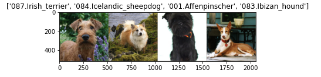
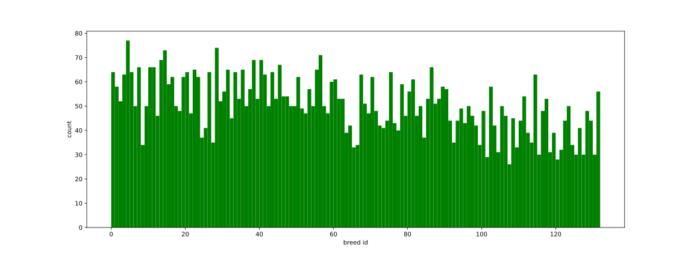

# Dog Breed Detection application
### Project Definition

#### Project Overview
The project is part of the Udacity Data Scientist Nanodegree program. The goal of the project is to construct and train a model that will classify images of dogs and detect their breed.

#### Problem Statement
Distinguishing between breeds is a difficult task even for humans. Often we know how to categorize the dog, but we couldn't really explain which details lead to the decision. To capture the nuances, we should examine many patterns in the input image. A deep convolutional neural network is a good fit here.

#### Metrics
Training loss is calculated at every iteration as the difference between the predicted breeds and the ones given by the manually classified dataset. It is decreasing throughout the training cycle. Another loss metric is being calculated on a separate validation set of images to control that we are not overfitting the model. Only as long as the validation loss is decreasing, the model is being saved.

### Analysis
#### Data Exploration
A dataset with 133 different breeds is provided. For training purposes I split it into 6680 train, 835 validation and 836 test images. For the training, all the images are being scaled down to 224x224 pixels. Even that is quite a lot of data and training the network without a GPU would not be possible.

The images from the dataset are assigned the correct breed:



There are some breeds that have more samples, though all of the breeds are well covered. The following histogram shows the distribution of the breeds in the training dataset, which is a random sample of the whole dataset.



### Model

The model used is based on a VGG16 network (https://arxiv.org/abs/1409.1556 by Karen Simonyan, Andrew Zisserman). The last layer of the model is replaced with a fully connected linear layer of size customized to the dataset with 133 classes.


The final model has been trained for 50 epochs achieving 87% test accuracy.

For the model to be robust, a set of distorting transformation operations is applied to the training images for each iteration. Such as random rotation or flipping.

### Conclusion
#### Reflection
For a given image of arbitrary dimensions we want to find out whether there is a dog of a specific breed in it. A convolutional neural network is a good choice for accomplishing the task. While it is difficult to point exactly at the parts of the deep network that are responsible for each classification decisions, the overall accuracy is very high. 

I started with building a network from scratch. It was not easy to tune it so that it would perform well. The model has been trained to 10% accuracy.

```
Net(
  (conv1): Conv2d(3, 16, kernel_size=(3, 3), stride=(1, 1), padding=(1, 1))
  (conv2): Conv2d(16, 32, kernel_size=(3, 3), stride=(1, 1), padding=(1, 1))
  (conv3): Conv2d(32, 64, kernel_size=(3, 3), stride=(1, 1), padding=(1, 1))
  (maxpool): MaxPool2d(kernel_size=2, stride=2, padding=0, dilation=1, ceil_mode=False)
  (fc1): Linear(in_features=65536, out_features=10000, bias=True)
  (fc2): Linear(in_features=10000, out_features=133, bias=True)
  (dropout): Dropout(p=0.5, inplace=False)
  (dropout2d): Dropout2d(p=0.5, inplace=False)
)
```

I found it difficult to find correct set up of the network, which would perform well. Unlike training a simpler model, the CNN network training takes time and requires computing resources, either more experience or a framework for automatically trying different combinations (like SciKit's GridSearch) would perhaps make it easier to find a better performing model written from scratch.

A VGG16 network has been trained for weeks on millions of images and I assume the front layers are well trained to capture distinguishing features in the image. It is easier to make use of these filters and train a layer on top of it.

I find it quite interesting that the pretrained layers of VGG16 have had such an impact on quality of the model and are so universal in their usage.


#### Improvement
An improvement would be an automated feedback and continuous retraining of the network. E.g. when a user asks for a breed to be detected and gets a wrong result the submitted image gets added to the dataset with a correct label. This of course assumes the user provides the correct answer. More data is usually beneficial for training of a deep learning network, so better results would be expected.

## Application
The application is a Flask REST API, which accepts a `POST` request with an image file at its root `/` and returns a response showing whether a human face or a dog has been detected. For a dog it will report a breed of the dog and for a
human face it will report which breed it is most similar too.


## How to build
```docker build -t dogbreed .```

## How to test
```
docker run -ePORT=3001 dogbreed
```
```
curl -D - -F "image=@pes1.jpg" <container address>:3001
```

## Libraries used
See the `requirements.txt` file.

## Acknowledgements
Thanks to Udacity for providing a skeleton of the jupyter notebook, which has made much easier to build the base of the project.

## Example


```curl -D - -F "image=@pes1.jpg" 172.17.0.2:3001```

```
HTTP/1.0 200 OK
Content-Type: text/html; charset=utf-8
Content-Length: 1403
Server: Werkzeug/2.0.1 Python/3.9.2
Date: Tue, 08 Jun 2021 20:28:15 GMT

A Beagle recognized in the image.


#S###G##G9#B9B9B9BB9BB&&r ,,,,,....,,,.,:::;;:;:;;:,:;:;
##99S#HHMG99BBB9BBB9B9B&s ::,,,..,,,:::,,,,,::;:::;i;r;;
GGG9MHGMHGS9BB&BBBB9BBB&h,,::,,,,::,::,:;;:::::,:;iri;;;
HHH#HMGGSS#S#H3Xsrs5H#9&#;:::,,:::,:,:,::::,;;:,.:;;,.;:
GSGGSHSG#SGM5Ai:,  .s5MS9r::;::;;:::,,,,:;;;;i;:;ii;iirr
G#GGSG#G#HHH2A2hMX,;553HHA:::::::;;;:;::irrrissirrisXA25
S#GSGG##HMBG5M#9GA:2#Sh#H2:i;i;;;sssrirrX2AssXrisXAA555h
SSG#SG#ShHBM2MHMX..X#9GBS522AAXs22AAX;sAA22XrXXX2AX25253
GSGGGSGMHh9S3X:. :i;shS&ShH33h33h35522553555225335533533
MGHSHSMHH3SBMi  A##Gr5&@SMGHhh3hh333333333hhhhhhh3hh353M
GHHSHS3MHhHB3; ;MB&9s3BBSS3333hhhhhhhhh33hhhhhhhhhhhhhMh
SHHGHGMMShhHMr;XG##GAhS###hA255hhMMMhhhhhhhhhhMhMhMMMMhh
SHMGHHGM#55hH3X5MMMGSGHHSSMA53352hhhMhMMMMMMhhHGHhhhhMMM
SSMGHMGSS5;rA3hHHMHHh35AXsrXh3Mh5223MHMMHHGGMMMhhhhhhMHH
SGhGGGhS#s.,::iAHM2ssXXsri;AMMGGM33523MMHMMMMMhhMhhhMMHH
H#HHSHGGSi,...,XHShiirrrsr;AMGSSHMMHh52hHHMMMMMHHMMMMHHM
G9GHSG##9h::;;;AMSAi;irsXs;AHSSSGGGGGH325MMMMHMHGHHMMHMM
GShGGSH#G#sisAA53HHhAsrsXXiAGS##SSSGGHM3Xi5HHMh52Assssrr
HSHSSGG#H#h:r22A5HhHhXrrsXrsHS99#SSSGHh32:.XAriii;;iiiii
SSGGGGH#H#S:;X552223h2i;iss2MS99##G5AXsA2;:s5M3Ariiiiiii
GSSH9MS#GG9s,sA5Hh5A53r:iXs3hMHS#G2Xrii;;;i5SG5Xri;rrrss
S#GG#H9GSG#M:iAAH#955Hr;rXX33hhHG3Asrrii;;sH9hXXXXrriiXX
S#GSSG9HHS#9A,XAMS95XHirsX253hHGShXsssrrri29BGh32srrriiA
S#SS#S9SSHG#M:iXhSGHs3isXA23hHSSShssXXAXAXh9SM3222Xrrrri⏎
```
